

   
  <picture>
    <source media="(prefers-color-scheme: dark)" srcset="https://img.shields.io/badge/🤖_AI_Telegram_Bot-v2.3.0-22C55E?style=for-the-badge&labelColor=1a1a2e&color=00d4aa">
    
  </picture>

    

  
<strong>Serverless • Type-Safe • Многоязычный • 68 Персон • RAG • Песочница кода • Инструменты • Режимы</strong>

  

    Боевой Telegram AI-ассистент, полностью работающий на Cloudflare Workers. 
    Работает на Workers AI — глобально распределён, без холодного старта, полностью типизирован.
  

   

  <!-- Badges Row 1: Tech -->
  

    
    
    
    
  

  <!-- Badges Row 2: Quality -->
  

    
    
    
    
  

  <!-- Language flags -->
  

    <a href="README.md">🇬🇧 English</a> ·
    <a href="README.fa.md">🇮🇷 فارسی</a> ·
    <a href="README.ar.md">🇸🇦 العربية</a> ·
    <a href="README.tr.md">🇹🇷 Türkçe</a> ·
    <a href="README.ru.md">🇷🇺 Русский</a>
  

   

---

<h2>📋 Содержание</h2>

  <a href="#-features">Возможности</a> •
  <a href="#-quick-start">Быстрый старт</a> •
  <a href="#-commands">Команды</a> •
  <a href="#-ai-models">AI Модели</a> •
  <a href="#-personas">Персоны</a> •
  <a href="#-architecture">Архитектура</a> •
  <a href="#-group-context-system">Контекст групп</a> •
  <a href="#-configuration">Конфигурация</a> •
  <a href="#-api-endpoints">API</a> •
  <a href="#-project-structure">Структура</a> •
  <a href="#-local-development">Разработка</a>

---

<h2>✨ Возможности</h2>

<table>
  <tr>
    <td align="center" width="14%">💬</td>
    <td width="36%"><strong>AI Чат</strong> Контекстно‑зависимый с 10 моделями на выбор</td>
    <td align="center" width="14%">🎭</td>
    <td width="36%"><strong>68 Персон</strong> 9 категорий + безлимитные собственные</td>
  </tr>
  <tr>
    <td align="center">🖼️</td>
    <td><strong>Генерация изображений</strong> 9 моделей: SDXL, Flux, Lightning, Lucid, FLUX.2 Klein 4B/9B, Phoenix, Dreamshaper</td>
    <td align="center">👁️</td>
    <td><strong>Понимание изображений</strong> AI описывает любое фото</td>
  </tr>
  <tr>
    <td align="center">🌐</td>
    <td><strong>Поиск в интернете</strong> Работает на Brave Search API</td>
    <td align="center">🔗</td>
    <td><strong>Просмотр сайтов</strong> Загрузка и суммаризация любого URL</td>
  </tr>
  <tr>
    <td align="center">📄</td>
    <td><strong>Чтение файлов</strong> Встроенный парсинг PDF, TXT, DOC</td>
    <td align="center">🎙️</td>
    <td><strong>Транскрипция голоса</strong> На базе Whisper</td>
  </tr>
  <tr>
    <td align="center">🗂️</td>
    <td><strong>Мульти‑сессии</strong> Независимые чаты</td>
    <td align="center">📤</td>
    <td><strong>Экспорт</strong> Скачать историю в .txt</td>
  </tr>
  <tr>
    <td align="center">🌍</td>
    <td><strong>5 Языков</strong> EN · FA · AR · TR · RU</td>
    <td align="center">👍</td>
    <td><strong>Кнопки обратной связи</strong> Оценка качества каждого ответа</td>
  </tr>
  <tr>
    <td align="center">🛡️</td>
    <td><strong>Ограничение запросов</strong> Троттлинг + кулдаун на пользователя</td>
    <td align="center">🛠️</td>
    <td><strong>Панель администратора</strong> Рассылка, статистика, блокировки, очистка</td>
  </tr>
  <tr>
    <td align="center">📊</td>
    <td><strong>Аналитика</strong> Метрики использования + активные пользователи</td>
    <td align="center">🧹</td>
    <td><strong>Автоочистка</strong> Автоматическая ротация старых данных</td>
  </tr>
  <tr>
    <td align="center">👥</td>
    <td><strong>Движок контекста группы</strong> Окна по 50 сообщений на пользователя + отслеживание ответов</td>
    <td align="center">🧵</td>
    <td><strong>Осведомлённость о цепочке</strong> Полное разрешение цепочки ответов до 5 уровней глубины</td>
  </tr>
  <tr>
    <td align="center">@</td>
    <td><strong>Встроенный режим</strong> Введите <code>@bot query</code> в любом чате</td>
    <td align="center">🔊</td>
    <td><strong>Текст в речь</strong> Melo TTS с поддержкой 5 языков</td>
  </tr>
  <tr>
    <td align="center">⚡</td>
    <td><strong>Стриминг ответов</strong> Текст в реальном времени пока AI думает</td>
    <td align="center">🎭</td>
    <td><strong>Мульти-агентное взаимодействие</strong> <code>/debate</code> два персонажа обсуждают любую тему</td>
  </tr>
  <tr>
    <td align="center">📅</td>
    <td><strong>Ежедневные советы</strong> AI-приветствия с информацией о праздниках и событиях</td>
    <td align="center">⏰</td>
    <td><strong>Система напоминаний</strong> Пользовательские напоминания с выбором даты/времени и повтором</td>
  </tr>
  <tr>
    <td align="center">🗳️</td>
    <td><strong>Ансамблевое голосование</strong> Параллельный запрос 3 моделей, выбор лучшего судьёй</td>
    <td align="center">🧠</td>
    <td><strong>Адаптивная персона</strong> AI изучает черты пользователя из отзывов</td>
  </tr>
  <tr>
    <td align="center">🧭</td>
    <td><strong>Автомаршрутизация</strong> Классификация сообщений → маршрут к лучшей модели</td>
    <td align="center">📚</td>
    <td><strong>RAG</strong> <code>/learn</code> + <code>/forget</code> база знаний</td>
  </tr>
  <tr>
    <td align="center">💻</td>
    <td><strong>Песочница кода</strong> <code>/run</code> на 20 языках через Piston API</td>
    <td align="center">🧵</td>
    <td><strong>Память AI</strong> Автосуммаризация и контекстный вызов</td>
  </tr>
  <tr>
    <td align="center">📊</td>
    <td><strong>Тайминг пользователя</strong> Анализ времени ответа на пользователя</td>
    <td align="center">🛡️</td>
    <td><strong>Усиление ввода</strong> Лимит 10k символов, структурированное логирование</td>
  </tr>
  <tr>
    <td align="center">🏷️</td>
    <td><strong>Стикер / Местоположение / Контакт</strong> Поддержка мультимодальных типов сообщений</td>
    <td align="center"></td>
    <td></td>
  </tr>
  <tr>
    <td align="center">🔧</td>
    <td><strong>Инструменты (Вызов функций)</strong> Погода, калькулятор, словарь, криптовалюты, новости, часовые пояса (с циклом ReAct)</td>
    <td align="center">📋</td>
    <td><strong>Цепочки промптов / Рабочие процессы</strong> Многошаговые AI-процессы с подстановкой переменных</td>
  </tr>
  <tr>
    <td align="center">📝</td>
    <td><strong>Режим викторины</strong> 6 категорий, отслеживание серий, подсчёт очков</td>
    <td align="center">👨‍🏫</td>
    <td><strong>Режим учителя</strong> 3 уровня, автоматические уроки с упражнениями и резюме</td>
  </tr>
  <tr>
    <td align="center">💡</td>
    <td><strong>Режим мозгового штурма</strong> Расширяйте, категоризируйте, оценивайте и комбинируйте идеи</td>
    <td align="center">🧬</td>
    <td><strong>Векторный RAG</strong> Семантический поиск на основе эмбеддингов с косинусным сходством</td>
  </tr>
  <tr>
    <td align="center">🔊</td>
    <td><strong>Многоязычный TTS</strong> Выбор модели с учётом языка (EN, PT, ES, JA, FA, AR)</td>
    <td align="center">🎨</td>
    <td><strong>Изображения AI в ответах</strong> Авто-генерация из маркеров [GENERATE_IMAGE]</td>
  </tr>
  <tr>
    <td align="center">🗣️</td>
    <td><strong>Речь AI в ответах</strong> Авто-генерация речи из маркеров [GENERATE_SPEECH]</td>
    <td align="center">✏️</td>
    <td><strong>Поддержка отредактированных сообщений</strong> AI отвечает заново при редактировании сообщения</td>
  </tr>
  <tr>
    <td align="center">⚡</td>
    <td><strong>Кэш-слой KV</strong> Опциональное 3-уровневое кэширование (KV → память → БД)</td>
    <td align="center">🔒</td>
    <td><strong>Мьютекс сообщений</strong> Блокировка на D1 предотвращает состояния гонки</td>
  </tr>
  <tr>
    <td align="center"></td>
    <td></td>
    <td align="center"></td>
    <td></td>
  </tr>
</table>

---

<h2>🚀 Быстрый старт</h2>

<h3>Предварительные требования</h3>

<table>
  <tr>
    <td>☁️</td>
    <td><a href="https://dash.cloudflare.com/">Аккаунт Cloudflare</a></td>
  </tr>
  <tr>
    <td>🤖</td>
    <td><a href="https://t.me/botfather">Токен Telegram бота</a> от @BotFather</td>
  </tr>
  <tr>
    <td>📦</td>
    <td><a href="https://nodejs.org/">Node.js</a> 18+ (только для CLI развёртывания)</td>
  </tr>
</table>

 

<h3>Развёртывание за 3 минуты</h3>

<table>
  <tr>
    <th>Шаг</th>
    <th>Команда</th>
    <th>Описание</th>
  </tr>
  <tr>
    <td>1</td>
    <td><code>git clone https://github.com/RealClickClick/worker-ai-chatbot.git && cd worker-ai-chatbot && npm install</code></td>
    <td>Клонировать и установить</td>
  </tr>
  <tr>
    <td>2</td>
    <td><code>npx wrangler d1 create ai-telegram-bot-db</code></td>
    <td>Создать D1 базу → <b>скопировать id в <code>wrangler.toml</code></b></td>
  </tr>
  <tr>
    <td>3</td>
    <td>
      <code>npx wrangler secret put TELEGRAM_BOT_TOKEN</code> 
      <code>npx wrangler secret put BRAVE_API_KEY</code>  <i>(опционально)</i> 
      <code>npx wrangler secret put GOOGLE_GEMINI_API_KEY</code>  <i>(опционально)</i> 
      <code>npx wrangler secret put NEWS_API_KEY</code>  <i>(опционально)</i> 
      <code>npx wrangler secret put WEBHOOK_SECRET</code> <i>(опционально)</i> 
      <code>npx wrangler secret put ADMIN_IDS</code>     <i>(опционально)</i>
    </td>
    <td>Установить секреты</td>
  </tr>
  <tr>
    <td>4</td>
    <td><code>npx wrangler deploy</code></td>
    <td>Развернуть на Cloudflare</td>
  </tr>
</table>

 

<strong>☁️ Альтернатива: Панель управления Cloudflare (не требуются инструменты командной строки)</strong>

 

1. Перейдите в [Панель Cloudflare](https://dash.cloudflare.com/) → **Workers & Pages** → **Create Application** → **Create Worker**

   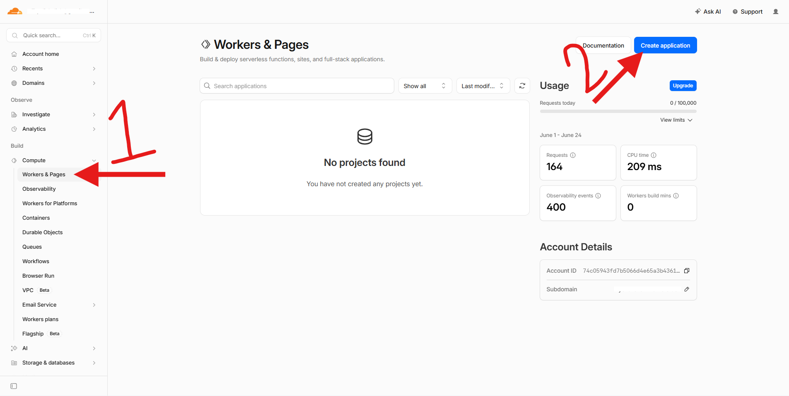

2. Оставьте шаблон **"Hello World"** и нажмите **Deploy**

   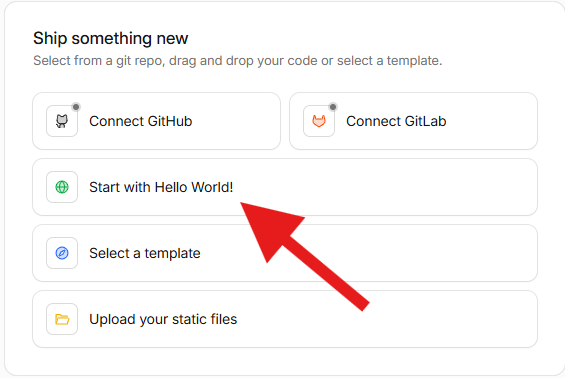
   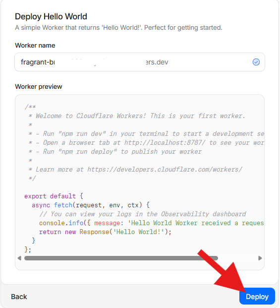

3. На панели worker нажмите **Edit code**

   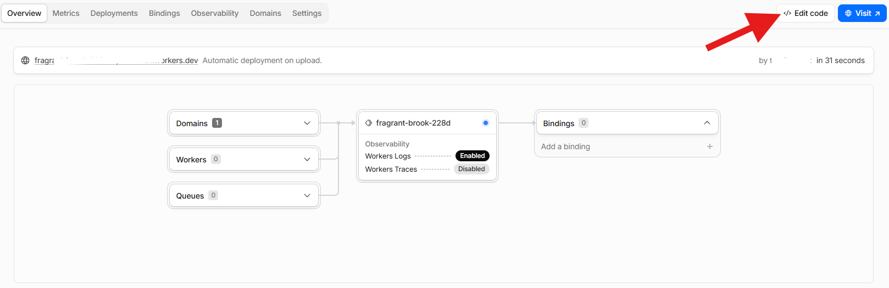

4. Выделите весь код Hello World → вставьте содержимое [`dist/worker.bundle.js`](dist/worker.bundle.js) → нажмите **Save and Deploy**

   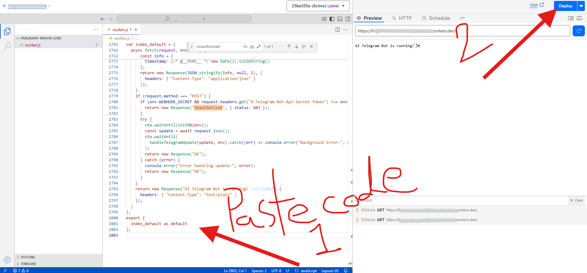

5. Перейдите в **Settings → Variables and Secrets** → **Add**, чтобы добавить переменные окружения:

   - `TELEGRAM_BOT_TOKEN` — токен бота из [@BotFather](https://t.me/BotFather)
   - `WORKER_DOMAIN` — `your-worker-name.your-subdomain.workers.dev`
   - `ADMIN_IDS` — ваш Telegram ID (опционально)
   - `BRAVE_API_KEY` — для веб-поиска (опционально)
    - `GOOGLE_GEMINI_API_KEY` — для моделей Gemini (опционально)
    - `NEWS_API_KEY` — API ключ NewsAPI для инструмента новостей (опционально)
    - `WEBHOOK_SECRET` — для верификации webhook (опционально)
   - `BOT_NAME` — имя для бота (опционально)
   - `BOT_DESCRIPTION` — дополнительные инструкции в system prompt (опционально)

   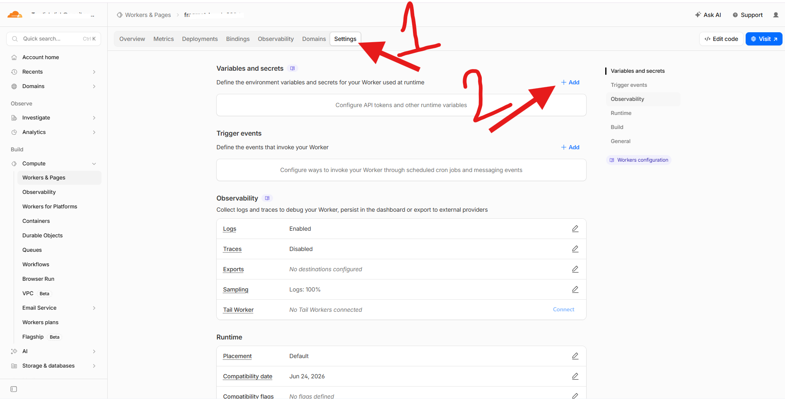
   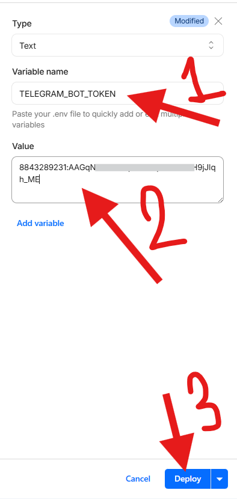
   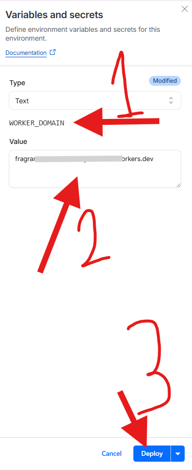

6. Перейдите в **Workers & Pages** → ваш worker → **Settings** → **Bindings** → **Add binding** → выберите **D1 Database** → назовите его `DB`

   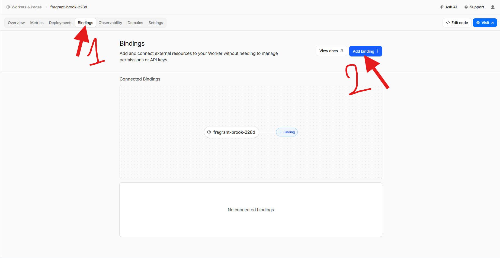
   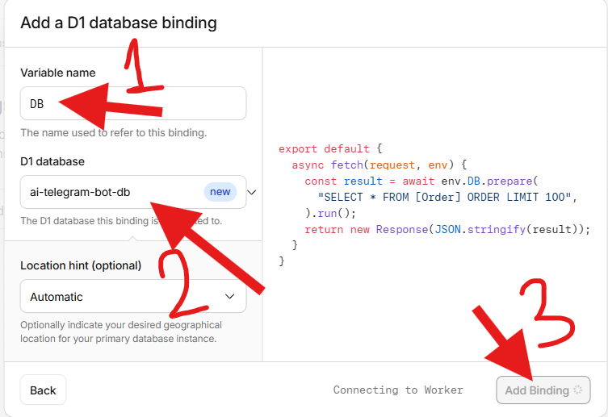

7. Перейдите в **Bindings** → **Add binding** → выберите **Workers AI** → назовите его `AI`

   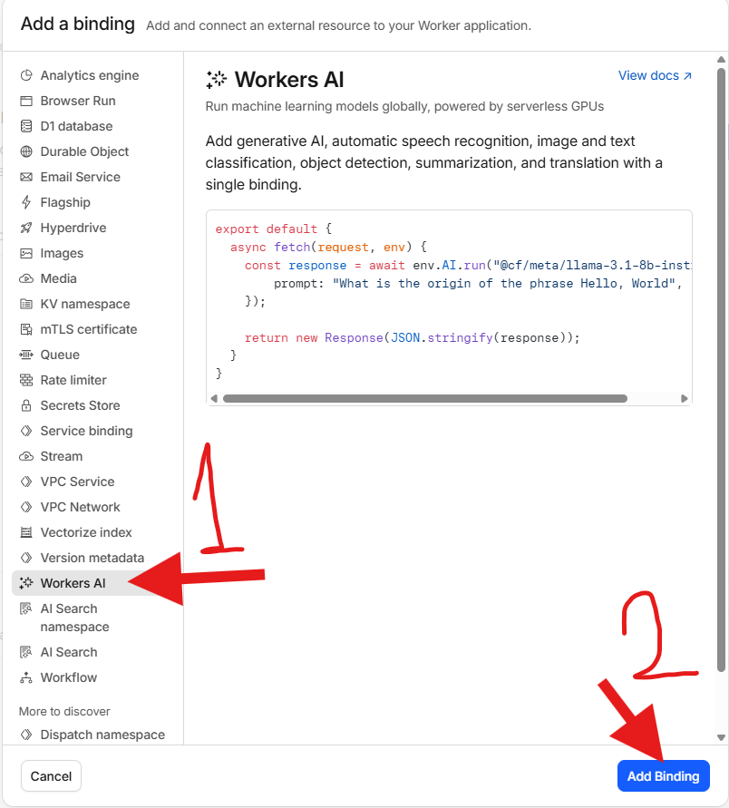
   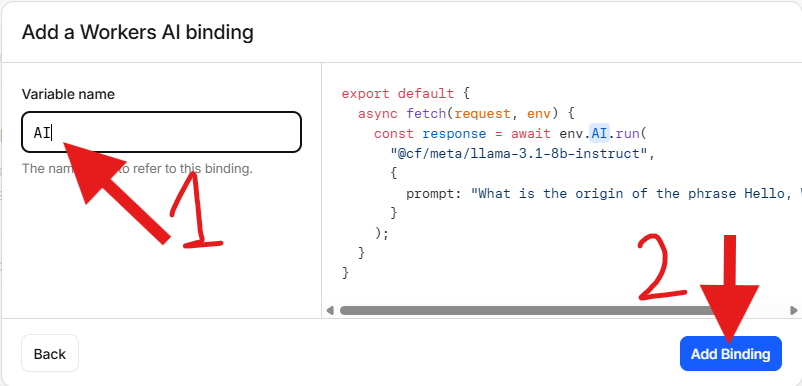

8. Перейдите на `https://your-worker.workers.dev/init` — создаёт все таблицы базы данных

   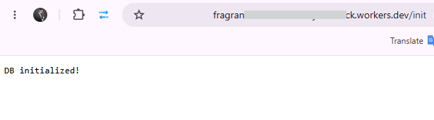

9. Перейдите на `https://your-worker.workers.dev/setWebhook` — регистрирует webhook URL в Telegram

   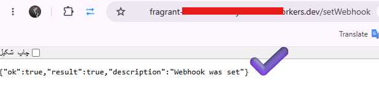

 

<h3>После развёртывания</h3>

<table>
  <tr>
    <th>Эндпоинт</th>
    <th>Назначение</th>
  </tr>
  <tr>
    <td><code>https://your-worker.workers.dev/init</code></td>
    <td>Инициализация таблиц БД и запуск миграций</td>
  </tr>
  <tr>
    <td><code>https://your-worker.workers.dev/setWebhook</code></td>
    <td>Регистрация webhook URL в Telegram</td>
  </tr>
</table>

> ✅ **Готово.** Ваш бот запущен — дополнительная настройка не требуется.

---

<h2>🎮 Команды</h2>

<table>
  <tr>
    <th>Команда</th>
    <th>Аргументы</th>
    <th>Описание</th>
  </tr>
  <tr>
    <td><code>/start</code></td>
    <td>—</td>
    <td>Приветственное сообщение с меню настроек</td>
  </tr>
  <tr>
    <td><code>/help</code></td>
    <td>—</td>
    <td>Полная справка по командам</td>
  </tr>
  <tr>
    <td><code>/mode</code></td>
    <td>—</td>
    <td>Выбор персоны и настроек</td>
  </tr>
  <tr>
    <td><code>/model</code></td>
    <td>—</td>
    <td>Сменить AI модель</td>
  </tr>
  <tr>
    <td><code>/lang</code></td>
    <td>—</td>
    <td>Сменить язык</td>
  </tr>
  <tr>
    <td><code>/image</code></td>
    <td><code>&lt;prompt&gt;</code></td>
    <td>Сгенерировать изображение</td>
  </tr>
  <tr>
    <td><code>/search</code></td>
    <td><code>&lt;query&gt;</code></td>
    <td>Поиск в интернете через Brave</td>
  </tr>
  <tr>
    <td><code>/translate</code></td>
    <td><code>&lt;text&gt;</code></td>
    <td>Перевести на текущий язык</td>
  </tr>
  <tr>
    <td><code>/summarize</code></td>
    <td>—</td>
    <td>Суммаризировать недавний разговор</td>
  </tr>
  <tr>
    <td><code>/instructions</code></td>
    <td><code>&lt;text&gt;</code> · <code>reset</code></td>
    <td>Задать собственное поведение AI</td>
  </tr>
  <tr>
    <td><code>/newpersona</code></td>
    <td><code>Name \| Desc</code> · <code>list</code> · <code>del &lt;n&gt;</code></td>
    <td>Создать / управлять собственными персонами</td>
  </tr>
  <tr>
    <td><code>/session</code></td>
    <td><code>new &lt;n&gt;</code> · <code>&lt;id&gt;</code> · <code>list</code> · <code>rename</code> · <code>del</code></td>
    <td>Управление мульти‑сессиями</td>
  </tr>
  <tr>
    <td><code>/export</code></td>
    <td>—</td>
    <td>Скачать разговор в <code>.txt</code></td>
  </tr>
  <tr>
    <td><code>/clear</code></td>
    <td>—</td>
    <td>Сбросить память, настройки, сессии</td>
  </tr>
  <tr>
    <td><code>/stats</code></td>
    <td>—</td>
    <td>Показать профиль и статистику использования</td>
  </tr>
  <tr>
    <td><code>/tts</code></td>
    <td><code>&lt;text&gt;</code></td>
    <td>Преобразовать текст в речь (персидский, английский, арабский, турецкий, русский)</td>
  </tr>
  <tr>
    <td><code>/debate</code></td>
    <td><code>&lt;topic&gt;</code></td>
    <td>Запустить мульти-агентную дискуссию между двумя персонажами</td>
  </tr>
  <tr>
    <td><code>/daily</code></td>
    <td>—</td>
    <td>Вкл/выкл ежедневные AI-советы с праздниками</td>
  </tr>
  <tr>
    <td><code>/remind</code></td>
    <td>—</td>
    <td>Создать напоминание (мастер: название → дата → время → повтор)</td>
  </tr>
  <tr>
    <td><code>/reminders</code></td>
    <td>—</td>
    <td>Список и управление активными напоминаниями</td>
  </tr>
  <tr>
    <td><code>/cancel</code></td>
    <td>—</td>
    <td>Отменить создание напоминания</td>
  </tr>
  <tr>
    <td><code>/learn</code></td>
    <td><code>&lt;text&gt;</code></td>
    <td>Обучить бота — сохранить в базу знаний (RAG)</td>
  </tr>
  <tr>
    <td><code>/forget</code></td>
    <td>—</td>
    <td>Очистить сохранённые знания</td>
  </tr>
  <tr>
    <td><code>/run</code></td>
    <td><code>&lt;lang&gt; &lt;code&gt;</code></td>
    <td>Выполнить код на 20 языках через Piston API</td>
  </tr>
  <tr>
    <td><code>/feedback</code></td>
    <td><code>&lt;message&gt;</code></td>
    <td>Отправить отзыв</td>
  </tr>
  <tr>
    <td><code>/tools</code></td>
    <td>—</td>
    <td>Включить/выключить инструменты (погода, калькулятор, словарь, крипто, новости, часовой пояс)</td>
  </tr>
  <tr>
    <td><code>/workflow</code></td>
    <td><code>create &lt;n&gt; | &lt;s1&gt; | ...</code> · <code>list</code> · <code>view</code> · <code>run</code> · <code>delete</code></td>
    <td>Создавать и запускать многошаговые цепочки промптов</td>
  </tr>
  <tr>
    <td><code>/mode_quiz</code></td>
    <td>—</td>
    <td>Запустить режим викторины (6 категорий, отслеживание серий)</td>
  </tr>
  <tr>
    <td><code>/mode_teacher</code></td>
    <td>—</td>
    <td>Запустить режим учителя (3 уровня, автоматические уроки)</td>
  </tr>
  <tr>
    <td><code>/mode_brainstorm</code></td>
    <td>—</td>
    <td>Запустить режим мозгового штурма (расширение, категоризация, оценка, комбинирование)</td>
  </tr>
  <tr>
    <td><code>/adapt</code></td>
    <td>—</td>
    <td>Показать профиль адаптивной персоны и черты</td>
  </tr>
  <tr>
    <td><code>/adapt reset</code></td>
    <td>—</td>
    <td>Сбросить данные обучения адаптивной персоны</td>
  </tr>
  <tr>
    <td><code>/admin</code></td>
    <td><code>stats</code> · <code>broadcast</code> · <code>block</code> · <code>unblock</code> · <code>blocked</code> · <code>cleanup</code></td>
    <td>Панель администратора (ограниченный доступ)</td>
  </tr>
</table>

---

<h2>🤖 AI Модели</h2>

<table>
  <tr>
    <th></th>
    <th>Ключ</th>
    <th>Model ID</th>
    <th>Params</th>
    <th>Vision</th>
    <th>Наилучшее применение</th>
  </tr>
  <tr>
    <td>⚡</td>
    <td><code>fast</code></td>
    <td><code>@cf/meta/llama-3.1-8b-instruct-fast</code></td>
    <td>8B</td>
    <td align="center">—</td>
    <td>Высокая пропускная способность, быстрые ответы</td>
  </tr>
  <tr>
    <td>⚖️</td>
    <td><code>balanced</code></td>
    <td><code>@cf/deepseek-ai/deepseek-r1-distill-qwen-32b</code></td>
    <td>32B</td>
    <td align="center">—</td>
    <td>Общего назначения, баланс качества/скорости</td>
  </tr>
  <tr>
    <td>🧠</td>
    <td><code>powerful</code></td>
    <td><code>@cf/meta/llama-3.3-70b-instruct-fp8-fast</code></td>
    <td>70B</td>
    <td align="center">—</td>
    <td>Сложные рассуждения, глубокий анализ</td>
  </tr>
  <tr>
    <td>🇨🇳</td>
    <td><code>glm</code></td>
    <td><code>@cf/zai-org/glm-4.7-flash</code></td>
    <td>—</td>
    <td align="center">—</td>
    <td>Многоязычность, быстрый инференс</td>
  </tr>
  <tr>
    <td>👁️</td>
    <td><code>vision</code></td>
    <td><code>@cf/meta/llama-3.2-11b-vision-instruct</code></td>
    <td>11B</td>
    <td align="center">✅</td>
    <td>Понимание и описание изображений</td>
  </tr>
  <tr>
    <td>🦙</td>
    <td><code>llama4</code></td>
    <td><code>@cf/meta/llama-4-scout-17b-16e-instruct</code></td>
    <td>17B</td>
    <td align="center">—</td>
    <td>Новейшее поколение MoE</td>
  </tr>
  <tr>
    <td>🔬</td>
    <td><code>gemma4</code></td>
    <td><code>@cf/google/gemma-4-26b-a4b-it</code></td>
    <td>26B</td>
    <td align="center">—</td>
    <td>Компактная, эффективная</td>
  </tr>
  <tr>
    <td>💻</td>
    <td><code>qwen_coder</code></td>
    <td><code>@cf/qwen/qwen2.5-coder-32b-instruct</code></td>
    <td>32B</td>
    <td align="center">—</td>
    <td>Генерация кода и технические задачи</td>
  </tr>
  <tr>
    <td>✨</td>
    <td><code>gemini_flash</code></td>
    <td><code>gemini-2.5-flash</code></td>
    <td>—</td>
    <td align="center">—</td>
    <td>Быстро и экономично (через API Google)</td>
  </tr>
  <tr>
    <td>✨</td>
    <td><code>gemini_flash_3</code></td>
    <td><code>gemini-3-flash</code></td>
    <td>—</td>
    <td align="center">—</td>
    <td>Новейший Gemini, мультимодальный (через API Google)</td>
  </tr>
</table>

 

<h3>Модели генерации изображений</h3>

<table>
  <tr>
    <th></th>
    <th>Ключ</th>
    <th>Model ID</th>
  </tr>
  <tr>
    <td>🎨</td>
    <td><code>sdxl</code></td>
    <td><code>@cf/stabilityai/stable-diffusion-xl-base-1.0</code></td>
  </tr>
  <tr>
    <td>🌊</td>
    <td><code>flux</code></td>
    <td><code>@cf/black-forest-labs/flux-1-schnell</code></td>
  </tr>
  <tr>
    <td>⚡</td>
    <td><code>lightning</code></td>
    <td><code>@cf/bytedance/stable-diffusion-xl-lightning</code></td>
  </tr>
  <tr>
    <td>🔮</td>
    <td><code>flux2_dev</code></td>
    <td><code>@cf/black-forest-labs/flux-2-dev</code></td>
  </tr>
  <tr>
    <td>💎</td>
    <td><code>lucid</code></td>
    <td><code>@cf/leonardo/lucid-origin</code></td>
  </tr>
  <tr>
    <td>🔥</td>
    <td><code>klein4b</code></td>
    <td><code>@cf/black-forest-labs/flux-2-klein-4b</code></td>
  </tr>
  <tr>
    <td>🔥</td>
    <td><code>klein9b</code></td>
    <td><code>@cf/black-forest-labs/flux-2-klein-9b</code></td>
  </tr>
  <tr>
    <td>🔥</td>
    <td><code>phoenix</code></td>
    <td><code>@cf/leonardo/phoenix-1.0</code></td>
  </tr>
  <tr>
    <td>🎨</td>
    <td><code>dreamshaper</code></td>
    <td><code>@cf/lykon/dreamshaper-8-lcm</code></td>
  </tr>
</table>

---

<h2>🎭 Персоны</h2>

  <strong>68 персон</strong> в <strong>9 категориях</strong> — каждая полностью описана на 5 языках. 
  Выбирайте через <code>/mode</code> или создайте свою через <code>/newpersona Name | Description</code>.

 

<table>
  <tr>
    <th>Категория</th>
    <th align="center">#</th>
    <th>Персоны</th>
  </tr>
  <tr>
    <td>💼 Бизнес и право</td>
    <td align="center">8</td>
    <td>Юрист, CEO, Бухгалтер, Маркетолог, Предприниматель, Инвестор, Консультант, HR-менеджер</td>
  </tr>
  <tr>
    <td>💻 Наука и технологии</td>
    <td align="center">8</td>
    <td>Хакер, Разработчик, Учёный данных, Кибербезопасник, Физик, Химик, Астроном, Математик</td>
  </tr>
  <tr>
    <td>🏥 Здоровье и благополучие</td>
    <td align="center">6</td>
    <td>Доктор, Терапевт, Диетолог, Психиатр, Тренер, Йог</td>
  </tr>
  <tr>
    <td>🎨 Искусство и культура</td>
    <td align="center">8</td>
    <td>Поэт, Писатель, Музыкант, Художник, Дизайнер, Архитектор, Кинорежиссёр, Фотограф</td>
  </tr>
  <tr>
    <td>🌍 Фэнтези и приключения</td>
    <td align="center">8</td>
    <td>Волшебник, Рыцарь, Пират, Инопланетянин, Вампир, Эльф, Дракон, Ведьма</td>
  </tr>
  <tr>
    <td>🎭 Личность и юмор</td>
    <td align="center">10</td>
    <td>Злой, Депрессивный, Мотивационный, Карен, Нерд, Gen Z, Дедушка, Романтик, Комик, Конспиролог</td>
  </tr>
  <tr>
    <td>🐾 Животные и природа</td>
    <td align="center">6</td>
    <td>Кот, Собака, Лев, Сова, Дельфин, Панда</td>
  </tr>
  <tr>
    <td>👑 История и общество</td>
    <td align="center">8</td>
    <td>Король, Королева, Самурай, Исследователь, Детектив, Шпион, Журналист, Философ</td>
  </tr>
  <tr>
    <td>🙏 Духовное и мистическое</td>
    <td align="center">6</td>
    <td>Монах, Пророк, Шаман, Оракул, Мистик, Мудрец</td>
  </tr>
</table>

---

<h2>🏗️ Архитектура</h2>

<pre>
                           ┌─────────────────────────────────────┐
                           │        Cloudflare Worker            │
                           │     (edge — 50+ локаций)            │
                           │                                     │
  Telegram ──POST /──►     │  src/index.ts                       │
   (webhook)     │         │  ├─ проверка secret                 │
                 │         │  ├─ маршрутизация                   │
                 ▼         │  │  /init, /setWebhook,             │
                           │  │  /health, /cleanup, POST /       │
                           │  └──────────────────┬───────────────│
                           │                     │               │
                           │             ┌───────▼────────┐      │
                           │             │  handleMessage  │      │
                           │             │  handleCommand  │      │
                           │             │ handleCallback  │      │
                           │             └───────┬────────┘      │
                           │                     │               │
                           │    ┌────────────────▼───────────┐   │
                           │    │  ai.ts ──── Workers AI     │   │
                           │    │  db.ts ──── D1 (SQLite)    │   │
                           │    │  telegram.ts ── Telegram   │   │
                           │    └────────────────────────────┘   │
                           │            │                        │
                           └────────────┼────────────────────────┘
                                        │
                          Telegram API ◄┘
                              │
                              ▼
                           Telegram User
</pre>

<h3>Поток данных</h3>

<pre>
  ① Telegram → POST /  (верификация через secret_token)
  ② index.ts → дедупликация через update_id кэш + initCache(env)
  ③ message.ts → классификация: текст / фото / голос / файл / URL / команда / стикер / video_note / местоположение / контакт / edited_message
    ④ media-pipeline → processMedia(): загрузка, сохранение метаданных в D1, построение контекста
  ⑤ загрузка настроек (персона, модель, сессия, язык, инструменты, режим, ансамбль, маршрутизация) + RAG (векторный или LIKE) + сводка памяти + адаптация персоны
    ⑥ tools_enabled → внедрение описаний инструментов (погода, калькулятор, крипто, и т.д.)
  ⑦ ai.ts → сборка system prompt + получение недавней истории чата
  ⑧ Workers AI → запуск инференса с опциональным циклом повторного вызова инструментов (до 5 раундов)
  ⑨ пост-обработка: [GENERATE_IMAGE] → SDXL · [GENERATE_SPEECH] → TTS · [TOOL_CALL] → выполнение инструмента
    ⑩ htmlParser.ts → конвертация Markdown → Telegram HTML
    ⑪ telegram.ts → отправка форматированного ответа + кнопки обратной связи
    ⑫ сохранение сообщения пользователя и ответа AI в D1
    ⑬ recordInteraction() → анализ черт адаптивной персоны (каждые 15 сообщений)
</pre>

<h3>Технологический стек</h3>

<table>
  <tr>
    <th>Слой</th>
    <th>Технология</th>
    <th>Почему</th>
  </tr>
  <tr>
    <td>⚡ Среда выполнения</td>
    <td><a href="https://workers.cloudflare.com/">Cloudflare Workers</a></td>
    <td>Глобальные edge‑вычисления, без холодного старта (ES2022)</td>
  </tr>
  <tr>
    <td>📝 Язык</td>
    <td><a href="https://www.typescriptlang.org/">TypeScript</a> 5.7</td>
    <td>Полная типизация — <code>noImplicitAny</code> включён, 0 ошибок tsc</td>
  </tr>
  <tr>
    <td>📦 Бандлер</td>
    <td><a href="https://esbuild.github.io/">esbuild</a></td>
    <td>Мгновенная сборка, 305 kB минифицированного вывода</td>
  </tr>
  <tr>
    <td>🗄️ База данных</td>
    <td><a href="https://developers.cloudflare.com/d1/">D1 (SQLite)</a></td>
    <td>Автомиграции, 3 индекса, автоматическая очистка старых данных</td>
  </tr>
  <tr>
    <td>🤖 AI</td>
    <td><a href="https://developers.cloudflare.com/workers-ai/">Workers AI</a></td>
    <td>10 чат‑моделей + 9 моделей изображений + Whisper</td>
  </tr>
  <tr>
    <td>🧪 Тестирование</td>
    <td><a href="https://vitest.dev/">Vitest</a></td>
    <td>173 теста (модульные + интеграционные webhook‑сценарии)</td>
  </tr>
  <tr>
    <td>🔍 Линтинг</td>
    <td>ESLint (тесты) + <code>tsc --noEmit</code> (src)</td>
    <td>Разделение ответственности — типобезопасность + качество кода</td>
  </tr>
  <tr>
    <td>🎨 Форматирование</td>
    <td><a href="https://prettier.io/">Prettier</a></td>
    <td>Единый стиль кода</td>
  </tr>
</table>

---

<h3>Система контекста групп</h3>

Бот оснащён профессиональным <strong>движком контекста групп</strong> для интеллектуального участия в групповых чатах. При добавлении в группу он отслеживает окна сообщений для каждого пользователя (50 сообщений на пользователя), разрешает цепочки ответов и строит структурированный контекст для точных ответов ИИ.

<h4>Слой базы данных — таблица <code>group_messages</code></h4>

<pre>
group_messages (
  id                  INTEGER PRIMARY KEY    -- Автоинкремент
  chat_id             TEXT NOT NULL           -- ID группы
  user_id             TEXT NOT NULL           -- ID отправителя в Telegram
  message_id          INTEGER NOT NULL       -- ID сообщения в Telegram
  role                TEXT NOT NULL           -- 'user' | 'assistant'
  content             TEXT NOT NULL           -- Обработанный текст
  reply_to_message_id INTEGER                -- ID родительского сообщения (опционально)
  reply_to_user_id    TEXT                    -- Отправитель родительского сообщения (опционально)
  reply_to_content    TEXT                    -- Снимок текста родителя (опционально)
  thread_id           TEXT                    -- ID группы цепочки (опционально)
  user_name           TEXT NOT NULL DEFAULT ''-- Отображаемое имя
  created_at          TEXT DEFAULT (datetime('now'))
)
</pre>

<strong>4 индекса</strong> для оптимальных запросов:

<ul>
  <li><code>(chat_id, user_id, created_at)</code> — окно 50 сообщений на пользователя</li>
  <li><code>(chat_id, message_id)</code> — разрешение зависимостей ответов</li>
  <li><code>(chat_id, created_at)</code> — глобальный контекст окружения группы</li>
  <li><code>(chat_id, thread_id, created_at)</code> — запросы полной цепочки</li>
</ul>

<h4>Ядро модуля — <code>src/group-context.ts</code></h4>

<strong>Трёхуровневое построение контекста</strong> — для каждого группового сообщения собирается приоритезированный контекст:

<pre>
buildGroupContext(chatId, userId, message)
  │
  ├── Уровень 1: Цепочка ответов (наивысший приоритет)
  │   ├── resolveReplyChain() — отслеживание reply_to до 5 уровней глубины
  │   └── формат: "[Reply Chain] @user: msg → @user2: reply → Bot: response"
  │
  ├── Уровень 2: Окно пользователя (средний приоритет)
  │   ├── getUserWindow() — последние 50 сообщений конкретного пользователя
  │   └── формат: "[User History (last 50)] @user: text  @user: text  Bot: text"
  │
  └── Уровень 3: Контекст окружения (низкий приоритет)
      ├── getAmbientContext() — последние 5 глобальных сообщений группы
      └── формат: "[Recent Group Activity] @user3: msg  @user4: msg"
</pre>

<strong>Ключевые проектные решения:</strong>

<ul>
  <li><strong>Снимки</strong>: <code>reply_to_content</code> берётся из объекта <code>reply_to_message</code> Telegram, а не из базы данных — сохранение контекста, даже если родительское сообщение вышло за пределы окна в 50 сообщений</li>
  <li><strong>Наследование нити</strong>: Когда пользователь отвечает на сообщение, <code>thread_id</code> наследуется от родителя (или создаётся новый, если его нет)</li>
  <li><strong>Автоматическая обрезка</strong>: Каждая вставка запускает <code>trimGroupHistory()</code>, поддерживая окно каждого пользователя ровно в 50 сообщений</li>
  <li><strong>Обрезка сообщений</strong>: Каждое сообщение в контексте обрезается до 200 символов для эффективности токенов</li>
</ul>

<h4>Групповой системный промпт</h4>

Функция <code>buildGroupSystemPrompt()</code> в <code>src/ai.ts</code> создаёт специализированный системный промпт с правилами группы на 5 языках:

<pre>
[GROUP CHAT RULES]
- This is a group chat with multiple users. Each message is prefixed with the sender's name.
- Pay attention to who said what and maintain conversation context.
- When replying to a specific user, address them by name.
- Use the reply chain context to understand threaded conversations.
- Only respond when directly addressed or when you have something valuable to add.
</pre>

<h4>Полный групповой поток</h4>

<pre>
① Telegram отправляет групповое сообщение
② Групповой фильтр: упоминание / ответ боту / команда?
③ storeGroupMessageAndGetInfo() — сохранение + определение thread_id + обрезка
④ Обработка медиа (фото → Vision, голос → Whisper, файл → извлечение)
⑤ buildGroupContext() — построение 3-уровневого контекста
⑥ buildGroupSystemPrompt() — персона + правила группы + контекст
⑦ runChat() → Workers AI с обогащённым системным промптом
⑧ storeBotGroupMessage() — сохранение ответа бота
⑨ sendMessage() — форматированный ответ с кнопками обратной связи
</pre>

<h4>Сравнение DM vs Group</h4>

<table>
  <tr>
    <th>Аспект</th>
    <th>Личное сообщение</th>
    <th>Групповой чат</th>
  </tr>
  <tr>
    <td>Источник истории</td>
    <td>Таблица <code>chat_history</code> (последние 8 сообщений)</td>
    <td>Таблица <code>group_messages</code> (50 на пользователя + цепочка + окружение)</td>
  </tr>
  <tr>
    <td>Системный промпт</td>
    <td><code>buildSystemPrompt()</code> — стандартный</td>
    <td><code>buildGroupSystemPrompt()</code> — с правилами группы</td>
  </tr>
  <tr>
    <td>Отслеживание ответов</td>
    <td>Нет</td>
    <td>Полное разрешение цепочек (до 5 уровней)</td>
  </tr>
  <tr>
    <td>Хранение</td>
    <td><code>addChatMessage()</code> → <code>chat_history</code></td>
    <td><code>addGroupMessage()</code> → <code>group_messages</code></td>
  </tr>
  <tr>
    <td>Изоляция пользователей</td>
    <td>Один пользователь</td>
    <td>Окно 50 сообщений на пользователя</td>
  </tr>
  <tr>
    <td>Очистка истории</td>
    <td><code>trimHistory()</code> — глобальный лимит</td>
    <td><code>trimGroupHistory()</code> — лимит на пользователя + <code>cleanupOldGroupData()</code></td>
  </tr>
</table>

---

<h2>⚙️ Конфигурация</h2>

<table>
  <tr>
    <th>Переменная</th>
    <th align="center">Обязательно</th>
    <th>Описание</th>
  </tr>
  <tr>
    <td><code>TELEGRAM_BOT_TOKEN</code></td>
    <td align="center">✅</td>
    <td>Токен бота от <a href="https://t.me/botfather">@BotFather</a></td>
  </tr>
  <tr>
    <td><code>WORKER_DOMAIN</code></td>
    <td align="center">✅</td>
    <td>URL вашего worker (указывается в <code>wrangler.toml</code>)</td>
  </tr>
  <tr>
    <td><code>WEBHOOK_SECRET</code></td>
    <td align="center">—</td>
    <td>Секретный токен для верификации webhook‑запросов</td>
  </tr>
  <tr>
    <td><code>ADMIN_IDS</code></td>
    <td align="center">—</td>
    <td>Telegram ID администраторов через запятую</td>
  </tr>
  <tr>
    <td><code>BRAVE_API_KEY</code></td>
    <td align="center">—</td>
    <td>API ключ для <code>/search</code> от <a href="https://brave.com/search/api/">Brave Search</a></td>
  </tr>
  <tr>
    <td><code>GOOGLE_GEMINI_API_KEY</code></td>
    <td align="center">—</td>
    <td>API ключ Google AI Studio для моделей Gemini (<a href="https://aistudio.google.com/apikey">получить</a>)</td>
  </tr>
  <tr>
    <td><code>NEWS_API_KEY</code></td>
    <td align="center">—</td>
    <td>API ключ для новостного инструмента от <a href="https://newsapi.org/">NewsAPI</a></td>
  </tr>
</table>

Требуются биндинги D1 с именем <code>DB</code> и Workers AI с именем <code>AI</code>. Опционально, биндинг пространства имён KV с именем <code>KV_CACHE</code> включает постоянное кэширование между изолятами. Схема базы данных (16+ таблиц) автоматически создаётся при первом <code>/init</code> через встроенную систему миграций (v1–v28).

---

<h2>🔌 API Эндпоинты</h2>

<table>
  <tr>
    <th>Эндпоинт</th>
    <th>Метод</th>
    <th>Назначение</th>
  </tr>
  <tr>
    <td><code>/</code></td>
    <td><code>POST</code></td>
    <td>Приём webhook от Telegram</td>
  </tr>
  <tr>
    <td><code>/</code></td>
    <td><code>GET</code></td>
    <td>Страница статуса</td>
  </tr>
  <tr>
    <td><code>/init</code></td>
    <td><code>GET</code></td>
    <td>Инициализация / миграция схемы D1</td>
  </tr>
  <tr>
    <td><code>/setWebhook</code></td>
    <td><code>GET</code></td>
    <td>Регистрация webhook в Telegram</td>
  </tr>
  <tr>
    <td><code>/health</code></td>
    <td><code>GET</code></td>
    <td>JSON со статусом, версией и временем работы</td>
  </tr>
  <tr>
    <td><code>/cleanup</code></td>
    <td><code>GET</code></td>
    <td>Ручная очистка старых данных (<code>?days=30</code>)</td>
  </tr>
  <tr>
    <td><code>/daily-cron</code></td>
    <td><code>GET</code></td>
    <td>Запуск ежедневных советов для всех включённых чатов</td>
  </tr>
  <tr>
    <td><code>/reminder-cron</code></td>
    <td><code>GET</code></td>
    <td>Запуск обработки просроченных напоминаний</td>
  </tr>
</table>

---

<h2>📁 Структура проекта</h2>

<strong>Нажмите для раскрытия</strong>

 

<pre>
<b>src/</b>
├── <b>index.ts</b>              #  Точка входа Worker — маршрутизация, проверка webhook
├── <b>ai.ts</b>                 #  AI инференс, сборка system prompt, веб-поиск
├── <b>db.ts</b>                 #  Обратно совместимые ре-экспорты (legacy)
├── <b>locales.ts</b>            #  i18n — 5 языков, интерполяция шаблонов
├── <b>locales/</b>              #  Файлы локалей для каждого языка
│   ├── <b>en.ts</b>              #  Английский (355+ ключей)
│   ├── <b>fa.ts</b>              #  Персидский (354+ ключей)
│   ├── <b>ar.ts</b>              #  Арабский (345+ ключей)
│   ├── <b>tr.ts</b>              #  Турецкий (345+ ключей)
│   └── <b>ru.ts</b>              #  Русский (345+ ключей)
├── <b>telegram.ts</b>           #  Telegram API клиент — повторные попытки, чанкинг, загрузки
├── <b>constants.ts</b>          #  Общие константы (лимиты, RAG, Piston и т.д.)
├── <b>model-config.ts</b>       #  Реестр моделей, возможности, конфиг стоимости
├── <b>types/</b>
│   ├── <b>env.d.ts</b>           #  Интерфейс Env, типы Telegram, UserSettings
│   └── <b>d1.ts</b>              #  Определения типов строк D1
├── <b>handlers/</b>
│   ├── <b>message.ts</b>        #  Классификатор сообщений + конвейер AI-ответов
│   ├── <b>command.ts</b>        #  Реализации всех /slash команд
│   ├── <b>callback.ts</b>       #  Маршрутизация inline-клавиатур
│   ├── <b>admin.ts</b>          #  Панель администратора (статистика, рассылка, блокировки, очистка)
│   ├── <b>session.ts</b>        #  Управление мульти-сессиями
│   ├── <b>persona.ts</b>        #  Создание собственных персон
│   ├── <b>daily.ts</b>          #  Ежедневные советы (крон)
│   ├── <b>reminder.ts</b>       #  Мастер напоминаний + крон
│   ├── <b>debate.ts</b>         #  Мастер мульти-агентных дискуссий
│   ├── <b>inline.ts</b>         #  Обработчик inline-запросов
│   ├── <b>adapt.ts</b>          #  Команды /adapt и /adapt reset
│   └── <b>workflow.ts</b>       #  Команда /workflow (create/list/view/run/delete)
├── <b>menus/</b>
│   ├── <b>modeMenu.ts</b>       #  Динамические меню персон/моделей/языков/клавиатур
│   ├── <b>debateMenu.ts</b>     #  Клавиатуры для потока дискуссий
│   └── <b>reminderMenu.ts</b>   #  Клавиатуры выбора даты/времени/повтора
├── <b>modes/</b>
│   ├── <b>types.ts</b>          #  Определения типов системы режимов
│   ├── <b>registry.ts</b>       #  Реестр режимов и поиск
│   ├── <b>exam.ts</b>           #  Реализация режима экзамена
│   ├── <b>quiz.ts</b>           #  Режим викторины (6 категорий, отслеживание серий)
│   ├── <b>teacher.ts</b>        #  Режим учителя (3 уровня, автоматические уроки)
│   └── <b>brainstorm.ts</b>     #  Режим мозгового штурма (расширение/категоризация/оценка/комбинирование)
├── <b>parsers/</b>
│   └── <b>htmlParser.ts</b>     #  Конвертер Markdown → Telegram HTML
├── <b>repositories/</b>
│   ├── <b>settings.repo.ts</b>  #  Настройки пользователя + миграции (v1–v28)
│   ├── <b>chat.repo.ts</b>      #  История чата + групповые сообщения
│   ├── <b>admin.repo.ts</b>     #  Лимиты, блокировки, аналитика, тайминги
│   ├── <b>cache.ts</b>          #  Кэш-слой БД (KV-кэш с TTL)
│   ├── <b>persona.repo.ts</b>   #  Пользовательские персоны + адаптация
│   ├── <b>debate.repo.ts</b>    #  Сессии дискуссий + сообщения
│   ├── <b>reminder.repo.ts</b>  #  CRUD напоминаний
│   ├── <b>documents.repo.ts</b> #  Хранение и поиск документов RAG
│   ├── <b>memory.repo.ts</b>    #  Хранение сводок памяти
│   ├── <b>media.repo.ts</b>     #  Метаданные медиа (фото, документы, голос и т.д.)
│   ├── <b>embeddings.repo.ts</b> #  Векторные эмбеддинги для RAG
│   └── <b>workflow.repo.ts</b>  #  CRUD для рабочих процессов
├── <b>services/</b>
│   ├── <b>index.ts</b>          #  Централизованный ре-экспорт сервисного слоя
│   ├── <b>settings.service.ts</b>  #  Бизнес-логика настроек пользователя
│   ├── <b>debate.service.ts</b>    #  Логика оркестрации дискуссий
│   ├── <b>ensemble.service.ts</b>  #  Параллельные запросы к моделям + выбор судьёй
│   ├── <b>persona-adaptive.service.ts</b>  #  Извлечение черт AI из отзывов
│   ├── <b>router.service.ts</b>  #  Классификация сообщений → маршрутизация модели
│   ├── <b>rag.service.ts</b>     #  Разбивка текста, индексация, поиск
│   ├── <b>sandbox.service.ts</b> #  Выполнение кода Piston API (20 языков)
│   ├── <b>memory.service.ts</b>  #  AI-суммаризация и контекстный вызов
│   ├── <b>media-pipeline.service.ts</b>  #  Мультимодальная обработка медиа и вывод
│   └── <b>workflow.service.ts</b>  #  Движок выполнения рабочих процессов
└── <b>utils/</b>
    ├── <b>logger.ts</b>         #  Структурированное JSON-логирование с ID запросов
    ├── <b>mutex.ts</b>          #  Мьютекс на D1 для предотвращения состояний гонки
    ├── <b>cache.ts</b>          #  3-уровневый KV-кэш (KV → память → БД), кэши ответов/поиска
    ├── <b>error.ts</b>          #  Иерархия AppError, безопасные/повторные обёртки
    ├── <b>file.ts</b>           #  Загрузка файлов Telegram, извлечение текста из PDF
    ├── <b>media.ts</b>          #  Обработчики фото/документов/голоса/стикеров/video_note/местоположения/контактов
    ├── <b>validate.ts</b>       #  Вспомогательные функции валидации
    └── <b>occasions.ts</b>      #  Календарь праздников/событий для ежедневных советов

<b>tools/</b>
├── <b>types.ts</b>              #  Типы ToolDefinition и ToolCall, маркеры [TOOL_CALL]
├── <b>registry.ts</b>           #  Регистрация, парсинг и выполнение инструментов
├── <b>index.ts</b>              #  Инициализация инструментов и ре-экспорты
└── <b>builtins/</b>
    ├── <b>weather.ts</b>        #  Инструмент погоды (Open-Meteo, без API-ключа)
    ├── <b>calculator.ts</b>     #  Инструмент математического калькулятора
    ├── <b>time.ts</b>           #  Инструмент часовых поясов / мировых часов
    ├── <b>define.ts</b>         #  Инструмент словаря
    ├── <b>crypto.ts</b>         #  Инструмент цен криптовалют
    └── <b>news.ts</b>           #  Инструмент новостей (NEWS_API_KEY)

<b>config/</b>
├── <b>personas.ts</b>           #  68 определений персон (по 5 языков каждая)
└── <b>persona-emojis.ts</b>     #  Сопоставления эмодзи для состояний персон

<b>tests/</b>
├── <b>unit/</b>                 #  164 модульных теста (все модули)
└── <b>integration/</b>          #  9 интеграционных тестов (webhook-сценарии)
</pre>

---

<h2>🧪 Локальная разработка</h2>

<table>
  <tr>
    <th>Команда</th>
    <th>Описание</th>
  </tr>
  <tr>
    <td><code>npm install</code></td>
    <td>Установить зависимости</td>
  </tr>
  <tr>
    <td><code>npm run typecheck</code></td>
    <td><code>tsc --noEmit</code> — ноль ошибок</td>
  </tr>
  <tr>
    <td><code>npm test</code></td>
    <td><code>vitest --run</code> — 173 теста</td>
  </tr>
  <tr>
    <td><code>npm run test:watch</code></td>
    <td><code>vitest</code> — режим наблюдения</td>
  </tr>
  <tr>
    <td><code>npm run build</code></td>
    <td><code>esbuild</code> → <code>dist/worker.bundle.js</code></td>
  </tr>
  <tr>
    <td><code>npm run lint</code></td>
    <td>ESLint (тесты) + tsc (src)</td>
  </tr>
  <tr>
    <td><code>npm run format</code></td>
    <td>Prettier — форматировать всё</td>
  </tr>
  <tr>
    <td><code>npx wrangler dev --remote</code></td>
    <td>Локальный сервер разработки (удалённые биндинги)</td>
  </tr>
</table>

 

<h3>Локальное тестирование webhook</h3>

<pre>
npx wrangler dev --remote           # http://localhost:8787
ngrok http 8787                     # публичный HTTPS URL
curl http://localhost:8787/setWebhook
</pre>

---

<h2>📊 Статус проекта</h2>

<table>
  <tr>
    <th>Этап</th>
    <th>Описание</th>
    <th align="center">Статус</th>
  </tr>
  <tr>
    <td>1</td>
    <td>Миграция JS → TypeScript, tsconfig, CI pipeline</td>
    <td align="center">✅</td>
  </tr>
  <tr>
    <td>2</td>
    <td>Полные аннотации типов — <code>noImplicitAny: true</code>, 0 ошибок tsc</td>
    <td align="center">✅</td>
  </tr>
  <tr>
    <td>3</td>
    <td>Индексы D1, автоочистка, интеграционные тесты (всего 173)</td>
    <td align="center">✅</td>
  </tr>
  <tr>
    <td>4</td>
    <td>Встроенный режим, TTS, стриминг ответов, исправление ответов в группах, мульти-агентное взаимодействие (<code>/debate</code>)</td>
    <td align="center">✅</td>
  </tr>
  <tr>
    <td>5</td>
    <td>9 моделей изображений, Ежедневные советы (AI-крон + календарь событий), Система напоминаний (выбор даты/времени, повтор, уведомления)</td>
    <td align="center">✅</td>
  </tr>
  <tr>
    <td>6</td>
    <td>Ансамблевое голосование — параллельный запрос 3 моделей + стратегия судья/случайно</td>
    <td align="center">✅</td>
  </tr>
  <tr>
    <td>7</td>
    <td>Адаптивная персона — AI извлекает черты из отзывов пользователя</td>
    <td align="center">✅</td>
  </tr>
  <tr>
    <td>8</td>
    <td>Автомаршрутизация — классификатор сообщений направляет к лучшей модели</td>
    <td align="center">✅</td>
  </tr>
  <tr>
    <td>9</td>
    <td>RAG База знаний — <code>/learn</code> + <code>/forget</code>, поиск через LIKE</td>
    <td align="center">✅</td>
  </tr>
  <tr>
    <td>10</td>
    <td>Песочница кода — <code>/run</code> на 20 языках через Piston API</td>
    <td align="center">✅</td>
  </tr>
  <tr>
    <td>11</td>
    <td>Память AI — автосуммаризация и контекстный вызов</td>
    <td align="center">✅</td>
  </tr>
  <tr>
    <td>12</td>
    <td>Мультимодальность — поддержка стикеров, видео, местоположения, контактов</td>
    <td align="center">✅</td>
  </tr>
  <tr>
    <td>13</td>
    <td>Аналитика — время ответа на пользователя и отслеживание</td>
    <td align="center">✅</td>
  </tr>
  <tr>
    <td>14</td>
    <td>Производительность — инструментация стриминга + усиление ввода</td>
    <td align="center">✅</td>
  </tr>
  <tr>
    <td>15</td>
    <td>Инструменты (Вызов функций) — погода, калькулятор, словарь, криптовалюты, новости, часовые пояса с циклом ReAct</td>
    <td align="center">✅</td>
  </tr>
  <tr>
    <td>16</td>
    <td>Мультимодальный конвейер — хранение метаданных медиа, вывод [GENERATE_IMAGE] и [GENERATE_SPEECH], поддержка edited_message</td>
    <td align="center">✅</td>
  </tr>
  <tr>
    <td>17</td>
    <td>Цепочки промптов / Рабочие процессы — create/list/view/run/delete с подстановкой переменных</td>
    <td align="center">✅</td>
  </tr>
  <tr>
    <td>18</td>
    <td>Режимы — Викторина (6 категорий), Учитель (3 уровня), Мозговой штурм (расширение/категоризация/оценка/комбинирование)</td>
    <td align="center">✅</td>
  </tr>
  <tr>
    <td>19</td>
    <td>Адаптивная персона v2 — структурированный анализ 5 черт, визуализация профиля /adapt</td>
    <td align="center">✅</td>
  </tr>
  <tr>
    <td>20</td>
    <td>Векторный RAG — семантический поиск на основе эмбеддингов с косинусным сходством</td>
    <td align="center">✅</td>
  </tr>
  <tr>
    <td>21</td>
    <td>Кэш-слой KV — 3-уровневое кэширование (KV → память → БД), опциональная привязка KV_CACHE</td>
    <td align="center">✅</td>
  </tr>
  <tr>
    <td>22</td>
    <td>Мьютекс сообщений — блокировка на D1 предотвращает состояния гонки при конкурентной обработке</td>
    <td align="center">✅</td>
  </tr>
</table>

---

<h2>🤝 Участие в разработке</h2>

<ol>
  <li>Форкните репозиторий</li>
  <li>Создайте ветку для фичи: <code>git checkout -b feature/your-idea</code></li>
  <li>Зафиксируйте изменения: <code>git commit -m 'Add feature X'</code></li>
  <li>Отправьте: <code>git push origin feature/your-idea</code></li>
  <li>Откройте Pull Request</li>
</ol>

Пожалуйста, убедитесь:

<ul>
  <li>✅ <code>npm run typecheck</code> проходит (ноль ошибок tsc)</li>
  <li>✅ <code>npm test</code> проходит (все 173 теста)</li>
  <li>✅ Код соответствует существующим шаблонам (полная типизация, без изменений рантайма)</li>
  <li>✅ Обновите <code>README.md</code> при добавлении функций</li>
</ul>

---

<h2>📄 Лицензия</h2>

  <a href="LICENSE">MIT</a> — используйте свободно, модифицируйте и делитесь.

 

  
    Создано с ⚡ на <a href="https://workers.cloudflare.com/">Cloudflare Workers</a> ·
    Работает на <a href="https://developers.cloudflare.com/workers-ai/">Workers AI</a> ·
    Хранится в <a href="https://developers.cloudflare.com/d1/">D1 Database</a>
  
    
  
    <a href="https://github.com/RealClickClick/worker-ai-chatbot">GitHub</a> ·
    <a href="https://t.me/botfather">@BotFather</a> ·
    <a href="https://dash.cloudflare.com/">Cloudflare Dashboard</a>
  

